<!--
  ┌───────────────────────────────────────────────────────────┐
  │  You opened the source. Respect.                          │
  │  Since you are here: everything below was built by someone │
  │  who learned Python from error messages and stubbornness.  │
  │  There are 3 more comments hidden in this file. Good luck. │
  └───────────────────────────────────────────────────────────┘
-->

<div align="center">


<br/>


</div>

---

I build small things that talk to the physical world: microcontrollers, radios, GPS, servers in the basement. Mostly solo projects, mostly for the fun of solving it. If something in my house can be automated, mapped or made to answer questions out loud, it eventually will be.

- Danish and English, whichever you prefer
- Python for logic, Arduino/C++ when it has to run on a chip
- Strong preference for things that run locally, with no cloud account required
- Also a runner, which is how the race-prediction project started

<!-- Easter egg 1 of 3: the boot sequence below is not real. But it did take a suspicious amount of time to align. -->

```
  ┌─ topper@workshop ───────────────────────────────┐
  │ > booting workshop...                           │
  │   [ok] soldering iron ......... hot             │
  │   [ok] 3d printer ............. printing        │
  │   [ok] proxmox ................ 3 machines up   │
  │   [ok] esp32 .................. blinking        │
  │   [??] sleep schedule ......... not found       │
  └─────────────────────────────────────────────────┘
```

## Things I am building

<details>
<summary><b>T.A.B</b> — a local, offline voice assistant</summary>

<br/>

Terminal Assistant Butler. A Jarvis-style voice assistant that runs entirely on my own machine, no cloud.

- Ollama (`llama3.2:3b`) for the brain, faster-whisper for listening, Kokoro for the voice
- Modular skills, each defined by its own `SKILL.md` file
- Memory lives in a plain markdown vault, so I can read and edit what it remembers
- It can write new skills for itself, but anything outside the `skills/` folder needs a diff and my explicit go-ahead
- Dry, witty, and mirrors whichever language I speak to it in

</details>

<details>
<summary><b>GrassMapper</b> — GPS lawn mapping on an ESP32</summary>

<br/>

Walk the boundary of the lawn once, then track what has actually been mowed.

- ESP32 DevKit V1 with a u-blox NEO-6M GPS module
- Hosts its own WiFi access point and a dark-themed web app, no internet needed
- 1×1 m grid stored as a bitmask in LittleFS, up to 300k cells
- Live map with Leaflet and Esri satellite tiles — deliberately no Google Maps, so no API key
- Garden objects (trampoline, trees) can be dropped on the map as emoji markers

</details>

<details>
<summary><b>RF Controller</b> — learning and replaying 433.92 MHz remotes</summary>

<br/>

An ESP32 with a CC1101 radio that learns my own OOK remotes instead of having their codes hardcoded.

- Capture through a GDO0 interrupt, replay by bit-banging the same pin
- Multi-sample signatures so a learned button is matched reliably
- PySide6 desktop app to record, name and fire signals; everything stored as JSON
- Follow-up build: it fires automatically when I take damage in a game

</details>

<details>
<summary><b>Race Predictor</b> — what my Strava data thinks I can run</summary>

<br/>

- FastAPI + React/Vite, SQLite underneath
- Several prediction models side by side, including Riegel and VDOT
- Pulls straight from the Strava API
- Long-term plan: let T.A.B answer "what is a realistic 10k for me right now?"

</details>

<details>
<summary><b>The home lab</b> — Proxmox and friends</summary>

<br/>

- Proxmox host, 32 GB RAM, running whatever the current experiment is
- Home Assistant OS as VM 101
- Paper Minecraft server in an LXC container, mostly for redstone contraptions
- Next up: a Discord bot that can start and stop VMs

</details>

## Skill levels

<div align="center">
  
</div>

## The numbers

<div align="center">


<br/><br/>


<br/><br/>


</div>

## Snake, eating my commits

<div align="center">
  <picture>
    <source media="(prefers-color-scheme: dark)" srcset="https://raw.githubusercontent.com/TopperRN/TopperRN/output/snake-dark.svg" />
    <source media="(prefers-color-scheme: light)" srcset="https://raw.githubusercontent.com/TopperRN/TopperRN/output/snake.svg" />
    
  </picture>
</div>

<!-- Easter egg 2 of 3: the snake is regenerated every 12 hours by a robot I have never met. -->

<details>
<summary>Nothing to see here</summary>

<br/>

```
        .--.
       |o_o |     you found it.
       |:_/ |
      //   \ \    have a compliment:
     (|     | )   your taste in READMEs is excellent.
    /'\_   _/`\
    \___)=(___/
```

Things I say a lot while building:

> "It works. I do not know why yet, but it works."

</details>

---

<div align="center">

<sub>Built at a desk covered in jumper wires. Ideas and pull requests welcome.</sub>

<br/><br/>


</div>

<!-- Easter egg 3 of 3: if you scrolled this far, you are the kind of person I would happily debug something with at 1am. -->
